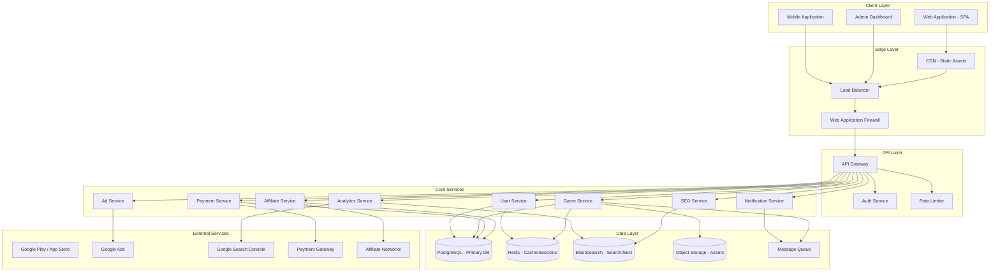
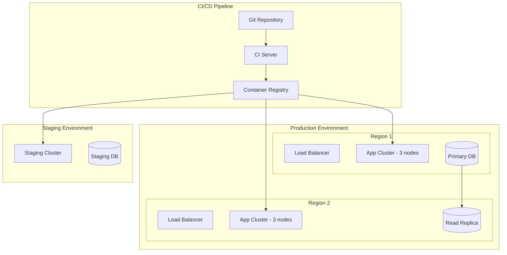
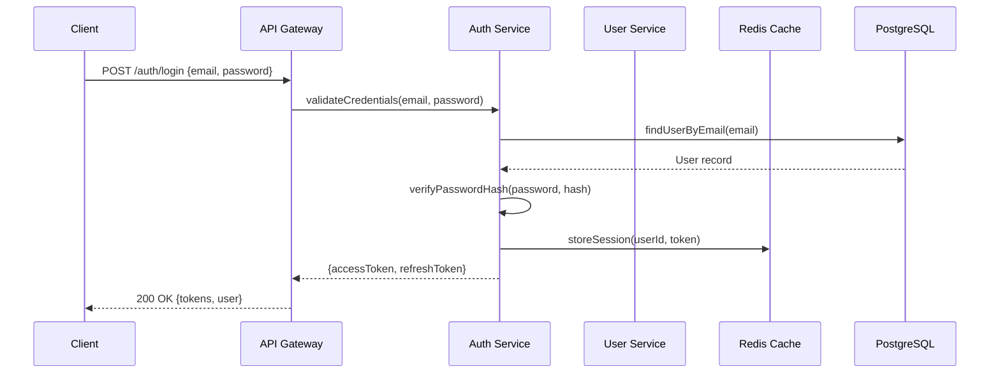
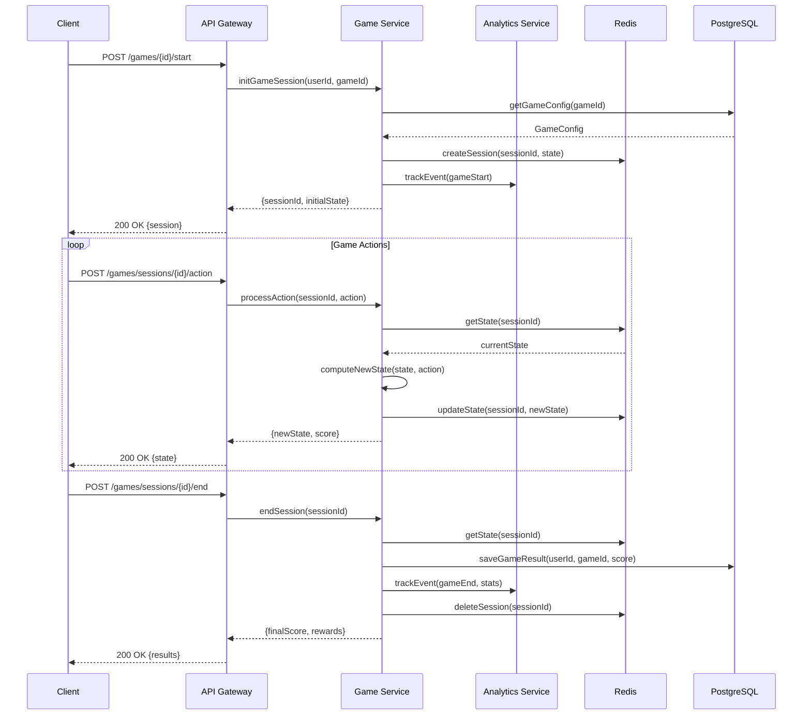
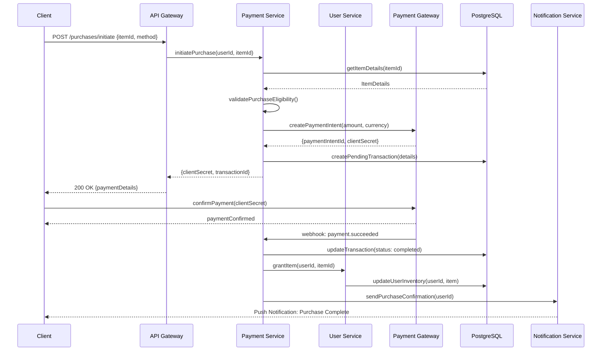

# Design Document: Gaming Platform

## Overview

This gaming platform is a comprehensive web and mobile application that hosts 25-30 integrated games with user engagement features, monetization mechanisms, and administrative tools. The platform provides a seamless gaming experience with user dashboards, in-app purchases, affiliate programs, and Google Ads integration while maintaining full legal compliance with data privacy regulations.

The architecture follows a microservices pattern with a centralized API gateway, enabling independent scaling of game services, user management, payment processing, and analytics. The system is designed for high concurrency, low latency game interactions, and real-time analytics tracking across both web and mobile clients.

The platform prioritizes SEO optimization for organic discovery, integrates comprehensive analytics for data-driven decisions, and implements robust security measures including authentication, authorization, and data encryption at rest and in transit.

## Architecture

### System Overview



### Deployment Architecture



## Sequence Diagrams

### User Authentication Flow



### Game Session Flow



### In-App Purchase Flow



## Components and Interfaces

### Component 1: User Service

**Purpose**: Manages user registration, profiles, preferences, inventory, and progression tracking.

**Interface**:
```lean
structure UserService where
  register : Credentials → IO (Except AuthError User)
  authenticate : Credentials → IO (Except AuthError TokenPair)
  getProfile : UserId → IO (Except NotFoundError UserProfile)
  updateProfile : UserId → ProfileUpdate → IO (Except ValidationError UserProfile)
  getInventory : UserId → IO (List Item)
  addToInventory : UserId → ItemId → IO (Except InventoryError Unit)
  getProgress : UserId → GameId → IO GameProgress
  updateProgress : UserId → GameId → ProgressUpdate → IO GameProgress
```

**Responsibilities**:
- User registration with email verification
- Password hashing and credential management
- Profile CRUD operations
- User inventory and virtual item management
- Game progress persistence
- Account deactivation and data export (GDPR)

### Component 2: Game Service

**Purpose**: Manages game catalog, session lifecycle, state management, and score tracking.

**Interface**:
```lean
structure GameService where
  listGames : GameFilter → Pagination → IO (PagedResult Game)
  getGame : GameId → IO (Except NotFoundError GameDetail)
  startSession : UserId → GameId → IO (Except GameError GameSession)
  processAction : SessionId → GameAction → IO (Except GameError GameState)
  endSession : SessionId → IO (Except GameError GameResult)
  getLeaderboard : GameId → LeaderboardFilter → IO (List LeaderboardEntry)
  getHistory : UserId → GameId → IO (List GameResult)
```

**Responsibilities**:
- Game catalog management and discovery
- Session initialization and state management
- Real-time game action processing
- Score calculation and leaderboard updates
- Game asset serving via CDN
- Integration with 25-30 external game modules

### Component 3: Payment Service

**Purpose**: Handles all monetary transactions including in-app purchases, subscription management, and payout processing for affiliates.

**Interface**:
```lean
structure PaymentService where
  initiatePurchase : UserId → PurchaseRequest → IO (Except PaymentError PaymentIntent)
  confirmPurchase : TransactionId → PaymentConfirmation → IO (Except PaymentError Receipt)
  refund : TransactionId → RefundReason → IO (Except PaymentError RefundResult)
  getTransactionHistory : UserId → DateRange → IO (List Transaction)
  getSubscription : UserId → IO (Option Subscription)
  manageSubscription : UserId → SubscriptionAction → IO (Except PaymentError Subscription)
```

**Responsibilities**:
- Payment intent creation and confirmation
- Transaction recording and audit trail
- Refund processing
- Subscription lifecycle management
- Revenue reporting for admin
- Payment gateway integration (Stripe/PayPal)

### Component 4: Affiliate Service

**Purpose**: Manages affiliate program including registration, link tracking, commission calculation, and payout management.

**Interface**:
```lean
structure AffiliateService where
  registerAffiliate : UserId → AffiliateApplication → IO (Except AffiliateError Affiliate)
  generateLink : AffiliateId → GameId → IO TrackingLink
  trackClick : TrackingCode → IO Unit
  trackConversion : TrackingCode → ConversionEvent → IO Unit
  getEarnings : AffiliateId → DateRange → IO EarningsReport
  requestPayout : AffiliateId → PayoutRequest → IO (Except PayoutError PayoutResult)
```

**Responsibilities**:
- Affiliate registration and approval workflow
- Unique tracking link generation
- Click and conversion attribution
- Commission calculation based on tiers
- Payout scheduling and processing
- Fraud detection for affiliate abuse

### Component 5: Analytics Service

**Purpose**: Collects, processes, and reports on user behavior, game performance, revenue metrics, and SEO data.

**Interface**:
```lean
structure AnalyticsService where
  trackEvent : AnalyticsEvent → IO Unit
  trackPageView : PageViewEvent → IO Unit
  getUserMetrics : UserId → DateRange → IO UserMetrics
  getGameMetrics : GameId → DateRange → IO GameMetrics
  getRevenueMetrics : DateRange → IO RevenueMetrics
  getSEOMetrics : DateRange → IO SEOMetrics
  generateReport : ReportType → ReportParams → IO Report
```

**Responsibilities**:
- Event ingestion and processing pipeline
- Real-time dashboard data aggregation
- Google Analytics and Search Console integration
- Custom report generation
- Data retention policy enforcement
- A/B test result tracking

### Component 6: Ad Service

**Purpose**: Manages ad placement, serving, and revenue optimization across the platform.

**Interface**:
```lean
structure AdService where
  getAdPlacement : AdContext → IO (Except AdError AdUnit)
  trackImpression : AdId → ImpressionContext → IO Unit
  trackClick : AdId → ClickContext → IO Unit
  getAdRevenue : DateRange → IO AdRevenueReport
  configureAd : AdConfig → IO (Except ValidationError AdUnit)
  manageAdBlock : AdBlockPolicy → IO Unit
```

**Responsibilities**:
- Google Ads integration and placement
- Ad impression and click tracking
- Revenue per page/game analytics
- Ad-blocker detection and handling
- Ad frequency capping
- GDPR-compliant ad personalization

## Data Models

### Model: User

```lean
structure User where
  id : UserId
  email : Email
  username : Username
  passwordHash : PasswordHash
  role : UserRole
  status : AccountStatus
  profile : UserProfile
  createdAt : Timestamp
  updatedAt : Timestamp
  lastLoginAt : Option Timestamp
  deriving Repr, BEq

inductive UserRole where
  | player : UserRole
  | admin : UserRole
  | affiliate : UserRole
  | moderator : UserRole
  deriving Repr, BEq, DecidableEq

inductive AccountStatus where
  | pending : AccountStatus
  | active : AccountStatus
  | suspended : AccountStatus
  | deactivated : AccountStatus
  deriving Repr, BEq, DecidableEq

structure UserProfile where
  displayName : String
  avatarUrl : Option String
  bio : Option String
  country : Option CountryCode
  preferredLanguage : LanguageCode
  notificationPrefs : NotificationPreferences
  privacySettings : PrivacySettings
  deriving Repr, BEq
```

**Validation Rules**:
- Email must be valid RFC 5322 format and unique
- Username must be 3-30 alphanumeric characters
- Password must be minimum 8 characters with complexity requirements
- Display name must not contain offensive content

### Model: Game

```lean
structure Game where
  id : GameId
  slug : GameSlug
  title : String
  description : String
  category : GameCategory
  tags : List Tag
  thumbnailUrl : String
  assets : GameAssets
  config : GameConfig
  status : GameStatus
  seoMetadata : SEOMetadata
  monetization : MonetizationConfig
  createdAt : Timestamp
  updatedAt : Timestamp
  deriving Repr, BEq

inductive GameCategory where
  | puzzle : GameCategory
  | action : GameCategory
  | strategy : GameCategory
  | casual : GameCategory
  | multiplayer : GameCategory
  | educational : GameCategory
  deriving Repr, BEq, DecidableEq

structure GameConfig where
  minPlayers : Nat
  maxPlayers : Nat
  sessionTimeout : Duration
  maxSessionDuration : Duration
  difficultyLevels : List DifficultyLevel
  features : List GameFeature
  deriving Repr, BEq

structure SEOMetadata where
  metaTitle : String
  metaDescription : String
  canonicalUrl : String
  ogImage : String
  structuredData : JsonLD
  keywords : List String
  deriving Repr, BEq
```

**Validation Rules**:
- Slug must be URL-safe and unique
- Title limited to 100 characters
- Description limited to 5000 characters
- Category must be from predefined enum
- Thumbnail must be valid image URL with correct dimensions
- SEO meta title limited to 60 characters, description to 160 characters

### Model: Transaction

```lean
structure Transaction where
  id : TransactionId
  userId : UserId
  itemId : ItemId
  amount : Money
  currency : CurrencyCode
  status : TransactionStatus
  paymentMethod : PaymentMethod
  gatewayReference : String
  metadata : TransactionMetadata
  createdAt : Timestamp
  completedAt : Option Timestamp
  deriving Repr, BEq

inductive TransactionStatus where
  | pending : TransactionStatus
  | processing : TransactionStatus
  | completed : TransactionStatus
  | failed : TransactionStatus
  | refunded : TransactionStatus
  | disputed : TransactionStatus
  deriving Repr, BEq, DecidableEq

structure Money where
  amount : Int  -- stored as cents/smallest unit
  currency : CurrencyCode
  deriving Repr, BEq

-- Invariant: amount >= 0 for purchases, < 0 for refunds
```

**Validation Rules**:
- Amount must be positive for purchases
- Currency must be valid ISO 4217 code
- Payment method must be supported
- Gateway reference must be non-empty for completed transactions
- Refund amount cannot exceed original transaction amount

### Model: Affiliate

```lean
structure Affiliate where
  id : AffiliateId
  userId : UserId
  status : AffiliateStatus
  tier : AffiliateTier
  commissionRate : CommissionRate
  trackingCode : TrackingCode
  earnings : AffiliateEarnings
  payoutInfo : PayoutInfo
  createdAt : Timestamp
  deriving Repr, BEq

inductive AffiliateTier where
  | bronze : AffiliateTier   -- 5% commission
  | silver : AffiliateTier   -- 10% commission
  | gold : AffiliateTier     -- 15% commission
  | platinum : AffiliateTier -- 20% commission
  deriving Repr, BEq, DecidableEq

structure AffiliateEarnings where
  totalEarned : Money
  pendingPayout : Money
  lifetimeClicks : Nat
  lifetimeConversions : Nat
  conversionRate : Float
  deriving Repr, BEq
```

**Validation Rules**:
- Commission rate must be between 0% and 50%
- Tracking code must be unique and URL-safe
- Payout info must be valid bank/PayPal details
- Minimum payout threshold of $50

### Model: GameSession

```lean
structure GameSession where
  id : SessionId
  userId : UserId
  gameId : GameId
  state : GameState
  score : Nat
  startedAt : Timestamp
  lastActivityAt : Timestamp
  endedAt : Option Timestamp
  duration : Duration
  actions : List GameAction
  deriving Repr, BEq

structure GameState where
  level : Nat
  lives : Nat
  powerUps : List PowerUp
  checkpoint : Option Checkpoint
  customData : Json
  deriving Repr, BEq

structure GameAction where
  actionType : ActionType
  payload : Json
  timestamp : Timestamp
  resultingScore : Nat
  deriving Repr, BEq
```

## Algorithmic Pseudocode

### Main Processing Algorithm: Game Session Management

```lean
/-- Initialize a new game session with validation -/
def initGameSession (userId : UserId) (gameId : GameId) : IO (Except GameError GameSession) := do
  -- Precondition: userId refers to an active user
  -- Precondition: gameId refers to an active, published game
  -- Postcondition: Returns a valid session or descriptive error
  
  let user ← UserRepo.findById userId
  match user with
  | none => return .error (.userNotFound userId)
  | some u =>
    if u.status ≠ AccountStatus.active then
      return .error (.userInactive userId)
    else
      let game ← GameRepo.findById gameId
      match game with
      | none => return .error (.gameNotFound gameId)
      | some g =>
        if g.status ≠ GameStatus.published then
          return .error (.gameUnavailable gameId)
        else
          -- Check concurrent session limit
          let activeSessions ← SessionRepo.countActive userId
          if activeSessions ≥ maxConcurrentSessions then
            return .error .tooManySessions
          else
            let sessionId ← generateSessionId
            let initialState := GameState.mk 1 g.config.defaultLives [] none "{}"
            let session := GameSession.mk sessionId userId gameId initialState 0
              (← now) (← now) none Duration.zero []
            SessionRepo.save session
            Analytics.track (.gameStart userId gameId sessionId)
            return .ok session

/-- Process a game action within a session -/
def processGameAction (sessionId : SessionId) (action : GameAction) 
    : IO (Except GameError GameState) := do
  -- Precondition: sessionId refers to an active session
  -- Precondition: action is a valid action for the current game state
  -- Postcondition: State is updated consistently
  -- Loop Invariant: Session state is always in a valid configuration
  
  let session ← SessionRepo.findById sessionId
  match session with
  | none => return .error (.sessionNotFound sessionId)
  | some s =>
    if s.endedAt.isSome then
      return .error (.sessionEnded sessionId)
    else
      -- Validate action against current state
      let validationResult := validateAction s.state action
      match validationResult with
      | .error e => return .error (.invalidAction e)
      | .ok _ =>
        -- Compute new state via game-specific rules
        let newState := computeNewState s.state action
        let newScore := calculateScore s.score action newState
        let updatedSession := { s with 
          state := newState
          score := newScore
          lastActivityAt := (← now)
          actions := s.actions ++ [action]
        }
        SessionRepo.save updatedSession
        -- Check if game over condition met
        if isGameOver newState then
          endSession sessionId
        else
          return .ok newState
```

### Authentication Algorithm

```lean
/-- Authenticate user credentials and issue token pair -/
def authenticate (creds : Credentials) : IO (Except AuthError TokenPair) := do
  -- Precondition: creds.email is non-empty valid email format
  -- Precondition: creds.password is non-empty
  -- Postcondition: On success, returns valid non-expired token pair
  -- Postcondition: On failure, returns descriptive error without leaking info
  
  let user ← UserRepo.findByEmail creds.email
  match user with
  | none => 
    -- Constant-time response to prevent timing attacks
    let _ ← dummyHashComputation
    return .error .invalidCredentials
  | some u =>
    if u.status = AccountStatus.suspended then
      return .error .accountSuspended
    else if u.status ≠ AccountStatus.active then
      return .error .accountInactive
    else
      let passwordValid ← verifyPasswordHash creds.password u.passwordHash
      if ¬passwordValid then
        let _ ← incrementFailedAttempts u.id
        let attempts ← getFailedAttempts u.id
        if attempts ≥ maxFailedAttempts then
          let _ ← lockAccount u.id
          return .error .accountLocked
        else
          return .error .invalidCredentials
      else
        -- Reset failed attempts on success
        let _ ← resetFailedAttempts u.id
        let accessToken ← generateAccessToken u
        let refreshToken ← generateRefreshToken u
        let _ ← storeRefreshToken u.id refreshToken
        let _ ← updateLastLogin u.id
        Analytics.track (.userLogin u.id)
        return .ok (TokenPair.mk accessToken refreshToken)

/-- Verify password hash using constant-time comparison -/
def verifyPasswordHash (password : String) (hash : PasswordHash) : IO Bool := do
  -- Precondition: password is non-empty string
  -- Precondition: hash is valid bcrypt/argon2 hash
  -- Postcondition: Returns true iff password matches hash
  -- Security: Uses constant-time comparison to prevent timing attacks
  
  let computed ← hashPassword password hash.salt hash.algorithm
  constantTimeEquals computed.bytes hash.bytes
```

### Affiliate Commission Calculation

```lean
/-- Calculate commission for an affiliate conversion event -/
def calculateCommission (affiliate : Affiliate) (event : ConversionEvent) 
    : IO (Except AffiliateError Commission) := do
  -- Precondition: affiliate is approved and active
  -- Precondition: event.amount > 0
  -- Postcondition: commission.amount ≤ event.amount * maxCommissionRate
  -- Postcondition: commission respects tier-based rate limits
  
  if affiliate.status ≠ AffiliateStatus.active then
    return .error (.affiliateInactive affiliate.id)
  else
    -- Determine commission rate based on tier
    let baseRate := match affiliate.tier with
      | .bronze => 0.05
      | .silver => 0.10
      | .gold => 0.15
      | .platinum => 0.20
    
    -- Apply bonus multipliers for special promotions
    let effectiveRate ← applyPromotionBonus baseRate event.gameId
    
    -- Ensure rate doesn't exceed maximum
    let cappedRate := min effectiveRate maxCommissionRate
    
    -- Calculate commission amount
    let commissionAmount := Money.mk 
      (Int.ofNat (Nat.div (event.amount.amount.toNat * (cappedRate * 100).toNat) 100))
      event.amount.currency
    
    -- Fraud check: verify conversion is legitimate
    let fraudScore ← checkFraudScore affiliate.id event
    if fraudScore > fraudThreshold then
      return .error (.suspectedFraud affiliate.id event.id)
    else
      let commission := Commission.mk 
        (← generateId) affiliate.id event.id commissionAmount 
        cappedRate CommissionStatus.pending (← now)
      CommissionRepo.save commission
      return .ok commission
```

### SEO Optimization Algorithm

```lean
/-- Generate and validate SEO metadata for a game page -/
def generateSEOMetadata (game : Game) (pageContext : PageContext) 
    : IO SEOMetadata := do
  -- Precondition: game has title and description
  -- Postcondition: metaTitle.length ≤ 60
  -- Postcondition: metaDescription.length ≤ 160
  -- Postcondition: canonicalUrl is valid absolute URL
  
  let metaTitle := truncateWithEllipsis game.title 57 ++ " | Platform"
  let metaDescription := truncateWithEllipsis game.description 157
  let canonicalUrl := buildCanonicalUrl game.slug pageContext
  let ogImage := selectBestImage game.assets.images
  
  -- Generate structured data (JSON-LD)
  let structuredData := JsonLD.mk [
    ("@context", "https://schema.org"),
    ("@type", "VideoGame"),
    ("name", game.title),
    ("description", game.description),
    ("genre", game.category.toString),
    ("url", canonicalUrl),
    ("image", ogImage),
    ("aggregateRating", buildRatingData game)
  ]
  
  -- Extract keywords from game metadata
  let keywords := extractKeywords game.title game.description game.tags
  
  return SEOMetadata.mk metaTitle metaDescription canonicalUrl ogImage structuredData keywords
```

## Key Functions with Formal Specifications

### Function: validatePurchaseEligibility

```lean
def validatePurchaseEligibility (userId : UserId) (item : PurchasableItem) 
    : IO (Except PurchaseError Unit) := do
  let user ← UserRepo.findById userId
  match user with
  | none => return .error .userNotFound
  | some u =>
    -- Check account status
    if u.status ≠ AccountStatus.active then
      return .error .accountInactive
    else
      -- Check age restriction
      if item.ageRestriction.isSome then
        match u.profile.dateOfBirth with
        | none => return .error .ageVerificationRequired
        | some dob =>
          if calculateAge dob < item.ageRestriction.get! then
            return .error .ageRestricted
          else pure ()
      else pure ()
      -- Check purchase limits
      let recentPurchases ← TransactionRepo.countRecent userId (Duration.hours 24)
      if recentPurchases ≥ dailyPurchaseLimit then
        return .error .dailyLimitExceeded
      else
        -- Check item availability
        let stock ← ItemRepo.getStock item.id
        if stock ≤ 0 ∧ item.isLimited then
          return .error .outOfStock
        else
          return .ok ()
```

**Preconditions:**
- `userId` is a valid UUID referencing an existing user
- `item` is a valid purchasable item in the catalog
- Payment service is available

**Postconditions:**
- Returns `Ok ()` if and only if all eligibility checks pass
- Returns specific `PurchaseError` variant for each failure mode
- No side effects on user data or inventory
- Does not modify transaction state

**Loop Invariants:** N/A (no loops in this function)

### Function: computeLeaderboard

```lean
/-- Compute top-N leaderboard for a game with tie-breaking -/
def computeLeaderboard (gameId : GameId) (limit : Nat) (period : TimePeriod) 
    : IO (List LeaderboardEntry) := do
  -- Precondition: limit > 0 ∧ limit ≤ 1000
  -- Postcondition: result.length ≤ limit
  -- Postcondition: ∀ i j, i < j → result[i].score ≥ result[j].score
  -- Postcondition: ties broken by earliest achievement timestamp
  
  let scores ← GameResultRepo.getTopScores gameId period limit
  let ranked := scores.enum.map fun (idx, entry) =>
    { entry with rank := idx + 1 }
  return ranked
```

**Preconditions:**
- `gameId` refers to an existing game
- `limit` is between 1 and 1000 inclusive
- `period` is a valid time range (not in the future)

**Postconditions:**
- Result list length is at most `limit`
- Result is sorted descending by score
- Ties are broken by earliest achievement time
- Each entry has a unique rank from 1 to result.length

**Loop Invariants:**
- During ranking assignment: all previously ranked entries maintain correct relative ordering

### Function: processAdImpression

```lean
/-- Record an ad impression with privacy-compliant tracking -/
def processAdImpression (adId : AdId) (context : ImpressionContext) 
    : IO Unit := do
  -- Precondition: adId refers to an active ad unit
  -- Precondition: context contains valid page and user session info
  -- Postcondition: impression is recorded for revenue tracking
  -- Postcondition: user privacy preferences are respected
  
  let consent ← getConsentStatus context.userId
  
  -- Only track with user consent (GDPR compliance)
  if consent.hasAdTracking then
    let impression := AdImpression.mk 
      (← generateId) adId context.userId context.pageUrl 
      context.placement (← now) context.deviceInfo
    AdRepo.saveImpression impression
    -- Increment counter for frequency capping
    let _ ← Redis.incr s!"ad_freq:{context.userId}:{adId}"
    let _ ← Redis.expire s!"ad_freq:{context.userId}:{adId}" frequencyCapWindow
  else
    -- Record anonymous impression for revenue without PII
    let anonImpression := AnonymousImpression.mk 
      (← generateId) adId context.pageUrl context.placement (← now)
    AdRepo.saveAnonymousImpression anonImpression
```

**Preconditions:**
- `adId` refers to a currently active and valid ad unit
- `context` contains non-null page URL and placement information
- Ad service connection is healthy

**Postconditions:**
- Exactly one impression record is created (either personalized or anonymous)
- User consent preferences are checked and respected
- Frequency cap counter is updated only when consent is given
- No PII stored without explicit consent

**Loop Invariants:** N/A

## Example Usage

```lean
-- Example 1: User Registration and Game Start
def exampleUserJourney : IO Unit := do
  -- Register new user
  let creds := Credentials.mk "player@example.com" "SecurePass123!"
  let regResult ← UserService.register creds
  match regResult with
  | .error e => IO.println s!"Registration failed: {e}"
  | .ok user =>
    IO.println s!"Welcome, {user.username}!"
    
    -- Browse available games
    let games ← GameService.listGames 
      (GameFilter.mk (some .casual) none none) 
      (Pagination.mk 1 20)
    
    -- Start a game session
    match games.items.head? with
    | none => IO.println "No games available"
    | some game =>
      let sessionResult ← GameService.startSession user.id game.id
      match sessionResult with
      | .error e => IO.println s!"Cannot start game: {e}"
      | .ok session =>
        IO.println s!"Playing {game.title}, session: {session.id}"
        
        -- Perform game actions
        let action := GameAction.mk .move (Json.mkObj [("x", 5), ("y", 3)]) (← now) 0
        let _ ← GameService.processAction session.id action
        
        -- End session
        let result ← GameService.endSession session.id
        IO.println s!"Game over! Final score: {result.score}"

-- Example 2: In-App Purchase
def examplePurchase (userId : UserId) : IO Unit := do
  let request := PurchaseRequest.mk (ItemId.mk "premium-skin-001") PaymentMethod.card
  let purchaseResult ← PaymentService.initiatePurchase userId request
  match purchaseResult with
  | .error e => IO.println s!"Purchase failed: {e}"
  | .ok intent =>
    IO.println s!"Complete payment with secret: {intent.clientSecret}"
    -- Client-side payment confirmation happens here
    -- Webhook confirms and grants item automatically

-- Example 3: Affiliate Link Tracking
def exampleAffiliateFlow (affiliateId : AffiliateId) : IO Unit := do
  -- Generate tracking link
  let link ← AffiliateService.generateLink affiliateId (GameId.mk "puzzle-game-01")
  IO.println s!"Share this link: {link.url}"
  
  -- When someone clicks and converts
  -- (This happens via webhook/event)
  let earnings ← AffiliateService.getEarnings affiliateId (DateRange.lastMonth)
  IO.println s!"Total earned: {earnings.totalEarned}"
  IO.println s!"Conversion rate: {earnings.conversionRate}%"
```

## Correctness Properties

*A property is a characteristic or behavior that should hold true across all valid executions of a system—essentially, a formal statement about what the system should do. Properties serve as the bridge between human-readable specifications and machine-verifiable correctness guarantees.*

### Property 1: Authentication Timing Uniformity

*For any* email address and password combination, the authentication response time SHALL be statistically indistinguishable regardless of whether the email exists in the system, preventing timing-based user enumeration.

**Validates: Requirement 1.4**

### Property 2: Account Lockout Enforcement

*For any* user account and sequence of failed authentication attempts, when the number of consecutive failures exceeds the maximum allowed attempts, the account SHALL transition to a locked state and reject all subsequent authentication attempts until administrative intervention.

**Validates: Requirements 1.5, 1.6**

### Property 3: Username and Email Validation

*For any* string submitted as a username, the User_Service SHALL accept it if and only if it is between 3 and 30 characters and consists entirely of alphanumeric characters. *For any* string submitted as an email, the User_Service SHALL accept it if and only if it conforms to RFC 5322 format.

**Validates: Requirements 2.4, 2.5**

### Property 4: Profile Update Round-Trip

*For any* valid profile update applied to a user, subsequently retrieving that user's profile SHALL return data reflecting all changes from the update.

**Validates: Requirements 2.1, 2.2**

### Property 5: Game Catalog Filter Correctness

*For any* game catalog and filter criteria (category, tags, search terms), all games returned in the result set SHALL be in published status and match the specified filter criteria, and no published game matching the criteria SHALL be excluded from the result.

**Validates: Requirements 3.1, 3.3, 3.4**

### Property 6: Game State Determinism

*For any* valid game state and valid game action, computing the new state SHALL always produce the same result regardless of when or how many times the computation is performed (pure function property).

**Validates: Requirements 4.3, 5.1**

### Property 7: Session Immutability After End

*For any* game session that has ended (either by user request, timeout, or game-over condition) and *for any* game action, submitting that action to the ended session SHALL be rejected without modifying any persisted state.

**Validates: Requirements 4.4, 5.5**

### Property 8: Invalid Action State Preservation

*For any* active game session and *for any* action that is invalid for the current game state, attempting to process that action SHALL leave the session state completely unchanged and return a descriptive error.

**Validates: Requirement 4.4**

### Property 9: Concurrent Session Limit Enforcement

*For any* user at the maximum concurrent session limit, attempting to start an additional game session SHALL be rejected with information about active sessions.

**Validates: Requirement 4.2**

### Property 10: Leaderboard Ordering Invariant

*For any* game and time period, the computed leaderboard SHALL be sorted in strictly descending order by score, with ties broken by earliest achievement timestamp, and ranks assigned as unique sequential integers from 1 to the result length.

**Validates: Requirements 6.1, 6.2, 6.4**

### Property 11: Transaction Amount Validity

*For any* purchase transaction, the amount SHALL be positive and the currency SHALL be a valid ISO 4217 code. *For any* refund, the refund amount SHALL not exceed the original transaction amount.

**Validates: Requirements 7.5, 7.6**

### Property 12: Purchase Eligibility Specificity

*For any* user who fails purchase eligibility validation, the Payment_Service SHALL return an error that specifically identifies the failure reason (inactive account, age restriction, daily limit exceeded, or out of stock) corresponding to the actual condition that failed.

**Validates: Requirement 7.3**

### Property 13: Daily Purchase Limit Enforcement

*For any* user who has reached the daily purchase limit within a rolling 24-hour window, subsequent purchase attempts SHALL be rejected until the window expires.

**Validates: Requirement 7.4**

### Property 14: Commission Rate Boundedness

*For any* active affiliate and *for any* conversion event, the calculated commission rate SHALL equal the tier-specific base rate (Bronze=5%, Silver=10%, Gold=15%, Platinum=20%) with promotional bonuses, and the effective rate SHALL never exceed the maximum allowed commission rate regardless of bonus combinations.

**Validates: Requirements 10.1, 10.2**

### Property 15: Affiliate Fraud Threshold Enforcement

*For any* conversion event where the fraud score exceeds the configured fraud threshold, the commission SHALL be rejected and the affiliate SHALL be flagged for review, regardless of the conversion amount or affiliate tier.

**Validates: Requirements 10.4, 11.1**

### Property 16: Affiliate Tracking Code Uniqueness

*For any* set of approved affiliates, all generated tracking codes SHALL be unique and URL-safe, ensuring no two affiliates share a tracking code.

**Validates: Requirement 9.2**

### Property 17: Minimum Payout Threshold

*For any* affiliate payout request where the pending balance is below $50, the request SHALL be rejected. *For any* request where the balance meets or exceeds $50, the request SHALL proceed to processing.

**Validates: Requirement 10.5**

### Property 18: Consent-Driven Ad Tracking

*For any* ad impression, if the user has NOT provided ad tracking consent, the recorded impression SHALL contain zero PII (no userId, no personal context). If the user HAS provided consent, the impression SHALL include personalized user context.

**Validates: Requirements 12.5, 12.6, 13.1**

### Property 19: Ad Frequency Cap Enforcement

*For any* user-ad combination, after the configured maximum number of impressions within the frequency cap window, the Ad_Service SHALL not serve that same ad to that user until the window expires.

**Validates: Requirement 12.4**

### Property 20: Consent Withdrawal Data Purge

*For any* user who withdraws consent, all PII-linked records with timestamps after the consent withdrawal moment SHALL be purged, while records created before withdrawal SHALL remain unaffected.

**Validates: Requirements 13.2, 13.3**

### Property 21: SEO Metadata Length Constraints

*For any* game (regardless of title or description length), the generated SEO meta title SHALL not exceed 60 characters and the meta description SHALL not exceed 160 characters, while the canonical URL SHALL be a valid absolute URL.

**Validates: Requirements 14.1, 14.2, 14.5**

### Property 22: SEO Structured Data Validity

*For any* game, the generated JSON-LD structured data SHALL conform to schema.org VideoGame type and contain all required fields (name, description, genre, url, image).

**Validates: Requirement 14.3**

### Property 23: Revenue Metrics Consistency

*For any* date range, the reported net revenue SHALL equal gross revenue minus refunds, ensuring financial reporting integrity.

**Validates: Requirement 15.4**

### Property 24: Admin Authorization Enforcement

*For any* user without the admin role, attempting any administrative action SHALL be rejected, ensuring role-based access control is enforced across all admin endpoints.

**Validates: Requirement 16.5**

### Property 25: JWT Validation Correctness

*For any* incoming API request, the API_Gateway SHALL accept the request if and only if it contains a valid, non-expired JWT token with a correct RS256 signature. Expired, malformed, or incorrectly signed tokens SHALL always be rejected.

**Validates: Requirement 17.1**

### Property 26: Rate Limiting Enforcement

*For any* authenticated user, after sending 100 requests within a one-minute window, subsequent requests within that same window SHALL receive a 429 response with a Retry-After header.

**Validates: Requirements 17.2, 17.3**

### Property 27: HTML Sanitization Completeness

*For any* user-generated content containing HTML or script injection payloads, the sanitization process SHALL remove all executable code while preserving safe text content, preventing XSS attacks.

**Validates: Requirement 18.4**

### Property 28: Age Restriction Enforcement

*For any* user whose age is below the threshold specified by applicable regulations, the Platform SHALL deny access to age-restricted content and block age-restricted purchases.

**Validates: Requirement 22.4**

### Property 29: Audit Trail Completeness

*For any* administrative action on user accounts and *for any* consent change event, the system SHALL create an audit log entry with a timestamp, actor, action type, and affected entity.

**Validates: Requirements 8.5, 13.6, 16.2**

## Error Handling

### Error Scenario 1: Payment Gateway Timeout

**Condition**: Payment gateway does not respond within 30 seconds during purchase confirmation
**Response**: Mark transaction as `pending_confirmation`, return user-friendly message indicating processing delay
**Recovery**: Background job retries gateway status check every 60 seconds for up to 24 hours; if confirmed, grant item and notify user; if failed, auto-refund and notify

### Error Scenario 2: Game Session State Corruption

**Condition**: Redis cache returns inconsistent state (e.g., negative lives, invalid level)
**Response**: Attempt state recovery from last valid checkpoint; if no checkpoint, gracefully end session with last known valid score
**Recovery**: Log corruption event for investigation, restore from PostgreSQL backup state if available, alert operations team if frequency exceeds threshold

### Error Scenario 3: Concurrent Session Conflict

**Condition**: User attempts to start a new game session while at maximum concurrent session limit
**Response**: Return clear error with information about active sessions and option to end one
**Recovery**: Provide API endpoint to force-end stale sessions (sessions inactive > 30 minutes auto-expire)

### Error Scenario 4: Affiliate Fraud Detection

**Condition**: System detects abnormal click patterns (rate > 100/min from single IP, geographic impossibility, bot signatures)
**Response**: Temporarily suspend tracking for the affiliate, flag for review, do not credit suspicious conversions
**Recovery**: Admin reviews flagged activity; if legitimate, restore status and credit; if fraudulent, permanently ban and reverse pending earnings

### Error Scenario 5: Database Connection Pool Exhaustion

**Condition**: All database connections in the pool are in use
**Response**: Queued requests wait up to 5 seconds; if still no connection, return 503 Service Unavailable with retry-after header
**Recovery**: Auto-scale connection pool up to hard limit; alert ops team; circuit breaker opens after 10 consecutive failures, redirecting reads to replica

### Error Scenario 6: Ad Service GDPR Consent Mismatch

**Condition**: User withdraws consent while ad impressions are being processed
**Response**: Immediately stop personalized tracking, switch to anonymous mode mid-request
**Recovery**: Purge any PII-linked impressions recorded after consent withdrawal timestamp, log compliance event for audit trail

## Testing Strategy

### Unit Testing Approach

Focus on pure business logic functions that can be tested in isolation:

- **Authentication**: Test password hashing, token generation/validation, rate limiting logic
- **Game State**: Test state transition functions, score calculations, validation rules
- **Commission Calculation**: Test tier rates, bonus multipliers, cap enforcement
- **SEO Metadata**: Test title truncation, URL generation, structured data formatting
- **Input Validation**: Test all validation functions with valid/invalid inputs

Coverage target: 90% line coverage for core business logic modules.

### Property-Based Testing Approach

**Property Test Library**: Lean's built-in `Plausible` or external `SlimCheck` for automated property checking

Key properties to test:
- Leaderboard ordering is preserved under any sequence of score submissions
- Commission calculation always stays within rate bounds regardless of input
- Game state machine only reaches valid states through valid transitions
- Authentication timing is constant regardless of user existence
- SEO metadata always meets length constraints regardless of input content
- Transaction state machine follows valid state transitions only

### Integration Testing Approach

- **API Integration Tests**: Test complete request/response cycles through API gateway
- **Payment Flow Tests**: Use payment gateway sandbox to test full purchase lifecycle
- **Game Session Tests**: Test WebSocket connections for real-time game state updates
- **Analytics Pipeline Tests**: Verify events flow from emission to dashboard visibility
- **Cross-Service Tests**: Test service-to-service communication under failure conditions

### End-to-End Testing

- **User Journey Tests**: Registration → Game Play → Purchase → Review complete flows
- **Affiliate Journey Tests**: Registration → Link Generation → Click → Conversion → Payout
- **Admin Journey Tests**: Game Management → User Moderation → Report Generation

## Performance Considerations

- **Response Time Targets**: API responses < 200ms at P95, game actions < 50ms at P95
- **Concurrent Users**: Support 10,000 concurrent game sessions
- **Database**: Read replicas for analytics queries, connection pooling with PgBouncer
- **Caching Strategy**: Redis for game sessions (TTL: session duration), user profiles (TTL: 5min), leaderboards (TTL: 30s)
- **CDN**: All static game assets served via CDN with aggressive caching headers
- **Database Indexing**: Composite indexes on (userId, gameId, createdAt) for history queries
- **Message Queue**: Async processing for analytics events, notifications, and commission calculations
- **Auto-scaling**: Horizontal pod autoscaling based on CPU/memory thresholds and request queue depth

## Security Considerations

- **Authentication**: JWT with RS256, access tokens expire in 15 minutes, refresh tokens in 7 days
- **Password Storage**: Argon2id with per-user salts, minimum 3 iterations
- **API Security**: Rate limiting (100 req/min per user), request signing for webhooks
- **Data Encryption**: AES-256-GCM at rest, TLS 1.3 in transit
- **Input Sanitization**: Parameterized queries (no SQL injection), HTML sanitization for user content
- **CORS Policy**: Strict origin whitelist for API access
- **Content Security Policy**: Strict CSP headers preventing XSS
- **Dependency Scanning**: Automated vulnerability scanning in CI/CD pipeline
- **Penetration Testing**: Quarterly external security audits
- **GDPR Compliance**: Right to erasure, data portability, consent management, DPO designation
- **PCI DSS**: Payment data never touches our servers (tokenization via payment gateway)

## Dependencies

### External Services
- **Payment Gateway**: Stripe (primary), PayPal (secondary)
- **Google Ads**: AdSense/Ad Manager for ad placement and revenue
- **Google Search Console**: SEO monitoring and indexing management
- **Google Analytics 4**: User behavior and conversion tracking
- **CDN Provider**: CloudFront or Cloudflare for asset delivery
- **Email Service**: SendGrid for transactional emails
- **Push Notifications**: Firebase Cloud Messaging (mobile), Web Push API

### Infrastructure
- **Database**: PostgreSQL 15+ (primary data store)
- **Cache**: Redis 7+ (sessions, caching, rate limiting)
- **Search**: Elasticsearch 8+ (game search, analytics)
- **Message Queue**: RabbitMQ or AWS SQS (async processing)
- **Object Storage**: S3-compatible (game assets, user uploads)
- **Container Orchestration**: Kubernetes with Helm charts
- **Monitoring**: Prometheus + Grafana (metrics), ELK Stack (logs)

### Client-Side
- **Web**: Modern SPA framework (React/Vue/Svelte)
- **Mobile**: Cross-platform framework (React Native/Flutter)
- **Game Engine**: HTML5 Canvas / WebGL for browser games
- **State Management**: Client-side state sync with server
